# Price-Direction Prediction — End-to-End MLOps Pipeline

A research-grade ML system that predicts the **next-day directional move** of FX pairs and turns it
into a daily trading signal.

A day is labelled by **walking the next day's 1-hour bars**: `Buy` if price reaches a 2×ATR
take-profit before a 1×ATR stop-loss (1:2 risk–reward), `Sell` for the mirror case, `Hold`
otherwise. Training, evaluation, and the backtester optimise and measure the *same* event.

> ⚠️ **Research/education only. NOT financial advice.**

## Signal Classes

| Label | Signal | Action |
|:---:|---|---|
| `0` | SELL 🔴 | SHORT — downward move expected |
| `1` | HOLD ⚪ | STAY OUT — skipped by backtest and live execution |
| `2` | BUY 🟢 | LONG — upward move expected |

## Pipeline

```mermaid
flowchart LR
    MT5[("MT5 terminal")] -->|fetch_data.py| RAW["data/fetch/{pair}_*.parquet"]
    RAW -->|feature_engineering.py| FEAT["data/features/{pair}/"]
    FEAT -->|search_models.py| SEARCH["leaderboard + best model"]
    SEARCH -->|hyperparameter_tuning.py| HPO["best_params/{pair}.json"]
    HPO -->|train_final.py| MODEL["saved_models/ + MLflow registry"]
    FEAT --> PRED["predict.py → signal"]
    MODEL --> PRED
    PRED -->|backtest_rr.py| BT["backtest_results/{pair}/"]
```



| Stage | Command | Output |
|---|---|---|
| Fetch + label | `python fetch/fetch_data.py` | `data/fetch/{pair}_raw/_processed.parquet` |
| Features | `python features/feature_engineering.py` | `data/features/{pair}/features.parquet`, `feature_columns.json`, `sequences.npz` |
| Model search | `python training/search_models.py` | `search_leaderboard_{pair}.csv`, `best_params/{pair}_best_model.json` |
| HPO (Optuna) | `python training/hyperparameter_tuning.py` | `best_params/{pair}.json` |
| Final train | `python training/train_final.py --model <name> --debugging False` | `saved_models/{pair}/`, plots, MLflow registry |
| Predict | `python predict.py --ticker EURUSD=X` | Printed signal, optional email/MT5 order |
| Backtest | `python backtest/backtest_rr.py --predictions <csv> --ticker EURUSD=X` | `backtest_results/{pair}/` |
| Serve | `python app.py` | `GET /predict` on `:8000` |

Or reproduce end-to-end: `cp utils/dvc_utils.yaml dvc.yaml && dvc repro`.

**Models:** LogisticRegression, SVM, KNN, RandomForest, ExtraTrees, GradientBoosting, AdaBoost,
Bagging, XGBoost\*, LightGBM\*, LSTM, BiLSTM, Transformer (PyTorch). Selected by 5-fold
`TimeSeriesSplit` `f1_macro` over 70/15/15 chronological splits. `*` = optional dependency.

## Layout

```text
configs/config.yaml         # single source of truth
fetch/        features/      # data fetch + ~100 technical/lag/rolling features
models/model_registry.py    # sklearn factory + LSTM/Transformer
training/                   # search_models → hyperparameter_tuning → train_final
backtest/backtest_rr.py     # intraday 1:2 RR simulation
utils/                      # MLflow/DagsHub, plotting, email, MT5 trading
app.py        predict.py    # FastAPI service / CLI signal
requirements.txt            # training  (pred_/app_requirements.txt for narrower envs)
```

## Setup

```bash
python -m venv .venv && source .venv/bin/activate   # Windows: .venv\Scripts\activate
pip install -r requirements.txt
```

- **Python 3.10**, **MetaTrader 5 terminal** (needed by `fetch_data.py`, `predict.py`,
  `backtest_rr.py`; the `MetaTrader5` package is Windows-only), and an MLflow backend.
- Edit `configs/config.yaml` — tickers, MLflow location (`dagshub`/`local`/`aws`), `trade.IC_MT5_PATH`,
  backtest multipliers.
- Create `.env`: `DAGSHUB_KEY`, `APP_PASSWORD` (and AWS keys only for S3/ECR modes).

## Deployment

```bash
docker compose up -d                 # reads .env, publishes :8000
```

GitHub Actions: `cicd.yaml` (build → ECR → EC2), `retrain.yaml` (`dvc repro`), `daily_prediction.yaml`
(fetch → features → predict). Secrets: `AWS_ACCESS_KEY_ID`, `AWS_SECRET_ACCESS_KEY`, `EC2_HOST`,
`EC2_SSH_KEY`, `DAGSHUB_TOKEN`, `EMAIL_PASSWORD`.

## Known Gaps

- **`predict.py` calls `make_labels(df)`**, but the current signature is `make_labels(daily_df, hourly_df, …)` → `TypeError` on the daily path.
- **`app.py` is stale** — 5-class era: reads `dc["ticker"]`/`dc["strong_threshold"]` (config has `tickers`/`strong_thresholds`) and calls the 2-arg `engineer_features`.
- **`predict.py --from-registry`** is passed by the workflow but its argparse flag is commented out → exits with an argparse error.
- **Prediction path mismatch:** `train_final.py` writes `predictions/{pair}_predictions.csv`; `backtest_rr.py --all` expects `predictions/{pair}/test_predictions.csv`.
- **`training.n_classes` is missing** from config (search defaults to 2, `train_final` DL path hardcodes 5).
- **`--debugging` defaults to `True`** (no MLflow, reduced data); pass `--debugging False` for real runs.
- **Backtest multipliers** `0.25`/`0.5` in config don't match the `1.0`/`2.0` used for labelling.
- **NFP guard** tests `weekday() == 3` (Thursday), not Friday.

## Disclaimer

For research and education only. Not financial advice. FX trading carries substantial risk of loss.
